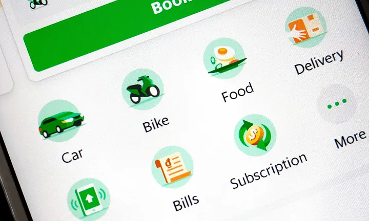
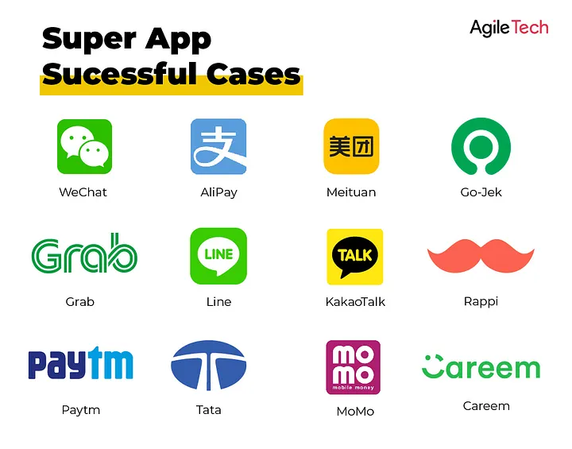
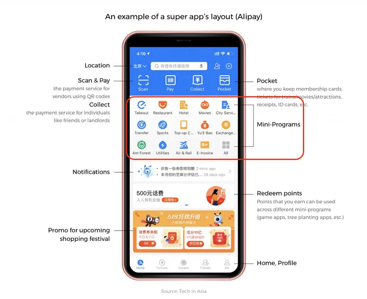
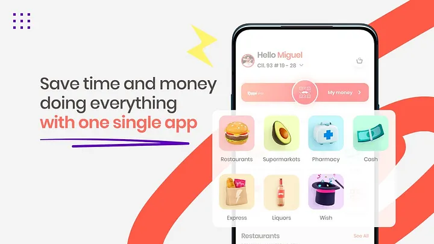
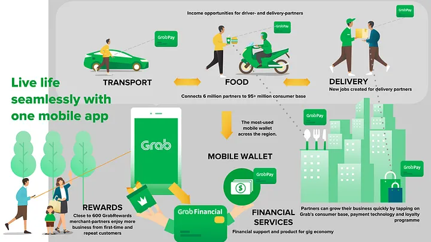
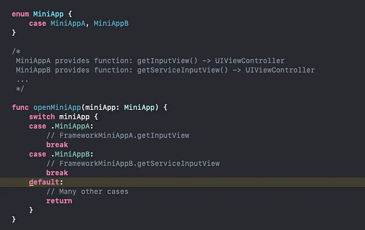
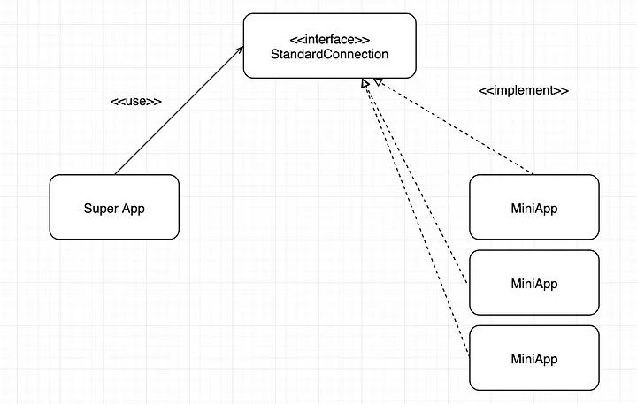
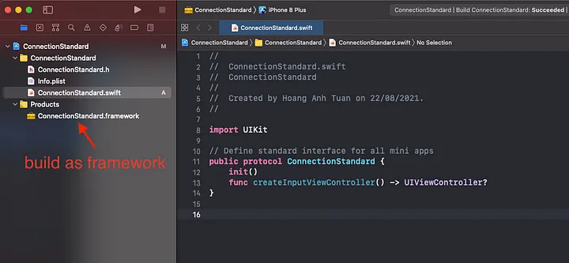
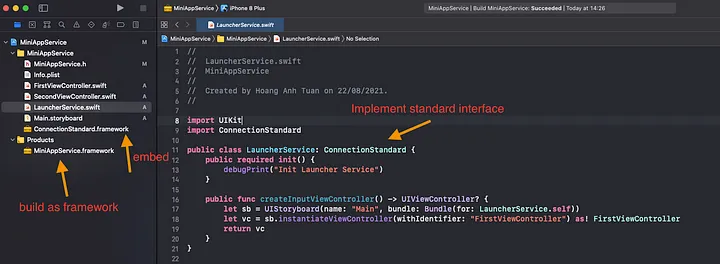
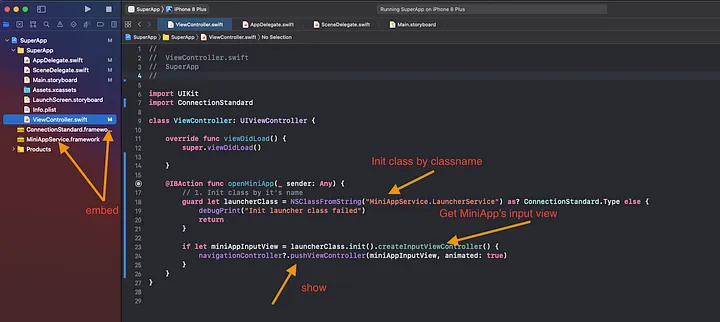

<!--more-->

These days, super apps are becoming more and more popular.
From the user’s perspective, super app is an app that has everything. Users benefit from the Super app because they can do everything in one app (book a car, flight, hotel, shop, etc.).

But from the developers’s side, I have many questions about the super app.
After a period of directly participating in the development of a super app, I have a better understanding of how super apps and mini apps work. So I wrote this article to give you an overview of how mini apps and super apps work together.  

In this post, I’m going to focus on answering 2 questions:
- How can we put an app inside another app?
- 1 normal app’s size is about 50–150MB. So why do many famous super app like Shopee, Grab, etc., which have many mini apps inside, only have the size of about 300MB?  

> Note: This solution I discuss in this post is not Grab's solution. I just mention Grab as an example for super app.

## What is super app, mini app?

Two terms, “super app” & “mini app”, go together.
A super app is an app that provides many different services, and these services could be made by different teams or companies.
Each of the services that the super app provides can be considered as a mini app.

## Benefits of super app

For Users:
- 1 app provides many services for users => Users can experience many services and utilities in 1 single app without changing app or download a new app.
Example: Zalo is a super app that provides many service, such as: pay bills, book cars/flight, shopping, etc..
- Save phone space because users don’t need to download other apps.

For Company:
- Share the number of users between super apps and mini apps.
- Super app becomes lively, has more features to compete with other apps.

## How to put a mini app inside a super app?

Before reading the answers, consider the following questions.

**Question 1**: How a super app open a mini app?

**Answer**
The source code of the super app must contains the source code of the mini app in the form of a framework. The MiniApp Team (MAT) will build the service which will be integrated into super app in the framework form, then send that framework to the super app team. The Super app team (SAT) will embed this framework into their source code.

This framework must meet some needs:
- MiniApp Framework must provide a public function that return a ViewController(iOS). This view is an input view of the mini app.
- MAT only builds the service which will be integrated into the super app under framework form, but doesn’t build all their application’s source code under framework form.

**Question 2**: One super app has many mini apps. What if each mini app provides a different function from the others, how will the super app handle it? We can not use switch-case here because there are many mini apps.

**Answer**
- SAT creates an interface and builds it in the form of a framework, then sends it to all the mini app teams. This interface is a standard for all mini apps to conform to.

This is the basic idea of how to integrate a mini app into a super app. Now let’s implement it.

**Implementation**

**Step 1**: SAT builds a standard interface that mini apps conform to, in the form of a framework.

**Step 2**: MAT implements that interface, then builds their service’s source code into the framework, and sends it to SAT to integrate.

**Step 3**: Super App get the mini app’s input view by using thepublic function that mini app provides, then show that view.

## Conclusion
- This article builds a simple demo project in order to give an overview of how the super app and the mini app connect to each other.
- In fact, to build a super app, there are still many other difficult problems such as: authentication between super app and mini app, payment between super app and mini app, etc. Those are also good problems that need to be solved.

## Source code
- You can find the demo source code on my github. You can download it *[here](https://github.com/hoangatuan/SuperAppSourceDemo)*.