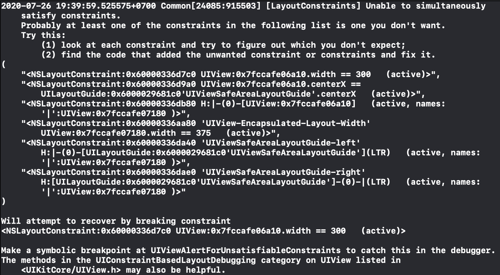
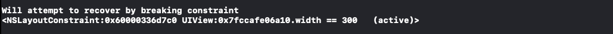
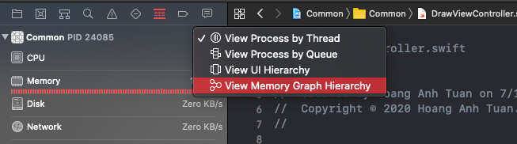
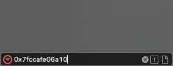
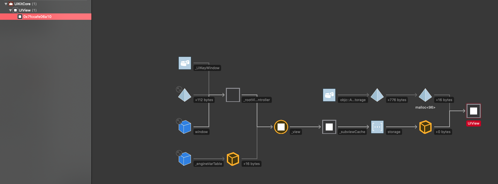
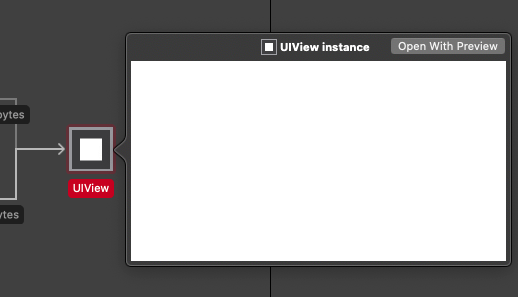
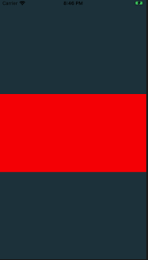
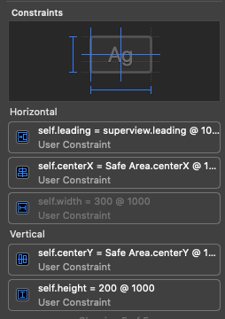

<!--more-->

## Problem

Có thể bạn đã từng gặp lỗi constraint bị breaking với kiểu log như thế này:



Thường thì Xcode sẽ tự loại bỏ 1 constraint để view không bị conflict nữa. Điều này sẽ dẫn đến UI hiển thị trên màn hình đúng hoặc không, tùy thuộc vào việc Xcode loại bỏ constraint nào.

Tuy nhiên, kể cả trong trường hợp UI hiển thị đúng, thì chúng ta vẫn nên đi fix cái lỗi này.

Đối với những màn hình phức tạp, nhiều subview, việc biết view nào đang bị lỗi constraint là khó có thể phán đoán được.

Vì vậy ở bài viết này, hãy cùng nhau đi đọc đống log kia để biết view nào đang bị conflict constraint 🙂

## Tìm xem view nào bị lỗi bằng cách đọc địa chỉ

Để í đến dòng log sau:



Đoạn log này hướng dẫn rằng code sẽ recover bằng cách loại bỏ constraint 0x60000336d7c0 của view có địa chỉ 0x7fccafe06a10.
Giờ thì bắt đầu đi tìm view có địa chỉ 0x7fccafe06a10:
- Chọn Show Debug Navigator (Command + 7).
- Chọn View Memory Graph Hierachy

- Nhập địa chỉ của View cần tìm vào phần Filter
<div style="text-align: center;">
    
</div>

- Chọn vào View có địa chỉ cần tìm, Xcode sẽ hiển thị kết quả như sau:



- Click chuột phải vào View, chọn Quick Look để xem đó là View nào:

<div style="text-align: center;">
    
</div>

- Với Quick Look, Xcode sẽ hiển thị View đang bị conflict constraint:

<div style="text-align: center;">
    
</div>

## Đổi màu background của View bằng lldb

Nếu trong trường hợp có quá nhiều View giống nhau, và bạn vẫn chưa thể xác định đó là view nào?
-> Dùng lldb để đổi màu background view đó để có thể xác định dễ hơn.

Đầu tiên, pause chương trình lại và thực hiện lệnh sau ở cửa sổ lldb:

```
expression [(UIView*)0x7fccafe06a10 setBackgroundColor:[UIColor redColor]]
```
- Với lệnh này, chọn Quick Look với View vừa rồi thì View đã chuyển sang màu đỏ rồi, nhưng vẫn chưa hiển thị trên màn hình simulator/device.
- Để View đổi màu ngay lập tức trên simulator/device, thực hiện tiếp 1 câu lệnh sau:

```
expression (void)[CATransaction flush]
```
OK, khi đó thì View bị lỗi constraint đã ngay lập tức đổi màu rồi.

<div style="text-align: center;">
    
</div>

## Xem tất cả constraint của View
- Mở Debug View Hierachy.
- Tìm và chọn view bị lỗi constraint
- Chọn Show the size inspector (Option + Command + 5)
- Khi đó, ở mục Constraint thì sẽ hiển thị tất cả constraint đang gắn với view đó. Cuối cùng thì chỉ cần bỏ đi constraint nào không cần thiết là được

<div style="text-align: center;">
    
</div>

Vừa leading, vừa centerX, vừa set width gây ra bị conflic constraint. Bỏ width constraint hoặc leading constraint tùy vào mục đích.

## Tham khảo
https://medium.com/ios-os-x-development/dynamically-modify-ui-via-lldb-expression-1b354254e1dd