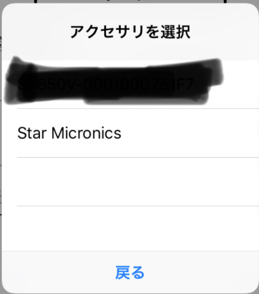

<!--more-->

## EAAcessory là gì?
- 1 đối tượng kiểu EAAcessory đại diện cho 1 thiết bị ngoại vi đang kết nối với app thông qua Lightning connector hoặc Bluetooth.
- EAAcessory gồm các thuộc tính chứa các thông tin quan trọng về thiết bị ngoại vi: isConnected, name, manufacturer, serialNumber, protocols mà thiết bị ngoại vi dùng, firmware version, …
- Ngoài ra, cũng có thể lấy macAddress của thiết bị ngoại vi:

```swift
let macAddress = accessory.value(forKey: PrinterConstant.MACAddress) as? String
```

- Từ những thông tin đó, bạn có thể mở 1 session tới thiết bị ngoại vi để trao đổi dữ liệu.

## Config Project
- Không phải cứ kết nối Bluetooth là app sẽ scan thấy hoặc lấy được thông tin của thiết bị ngoại vi đó
- Để app có thể giao tiếp với thiết bị ngoại vi, thì app cần khai báo các protocols mà thiết bị ngoại vi đó hỗ trợ vào Info.plist


## Đọc thông tin accessory

- Sau khi config project và kết nốt với thiết bị ngoại vi thông qua Bluetooth, có thể bắt đầu đọc thông tin của thiết bị ngọai vi:
Đầu tiên, import ExternalAccessory:

```swift
import ExternalAccessory
```

- Đọc thông tin:
```swift
let listAccessoryAvailable = EAAccessoryManager.shared().connectedAccessories
accessory = listAccessoryAvailable.first
print(accessory?.name)
print(accessory?.serialNumber)
print(accessory?.protocolStrings)
...
```

## Tạo socket để gửi/nhận data
- Để gửi/nhận data đến thiết bị ngoại vi thì cần mở 1 socket đến nó.
```swift
func openSession() {
    guard let accessory = self.accessory else {
        return
    }
        
    guard let protocolString = accessory.protocolStrings.first else {
        return
    }
        
    session = EASession(accessory: accessory, forProtocol: protocolString)
    if session != nil {
        session?.inputStream?.delegate = self
        session?.inputStream?.open()
        session?.inputStream?.schedule(in: .current, forMode: .default)
            
        session?.outputStream?.delegate = self
        session?.outputStream?.open()
        session?.outputStream?.schedule(in: .current, forMode: .default)
    }
}
```

- Conform to StreamDelegate để handle event của socket:

```swift
extension ViewController: StreamDelegate {
    func stream(_ aStream: Stream, handle eventCode: Stream.Event) {
        switch eventCode {
        case .openCompleted:
            print("Open session complete")
        case .hasBytesAvailable:
            print("Has bytes available")
        case .hasSpaceAvailable:
            print("Has space available")
        case .errorOccurred:
            let error = aStream.streamError
            print("Error occur")
        case .endEncountered:
            print("End stream")
            aStream.close()
            aStream.remove(from: .current, forMode: .default)
        default:
            return
        }
    }
}
```

| Gửi data đến thiết bị ngoại vi thông qua outputStream, nhận data từ thiết bị ngoại vi thông qua inputStream.

## Gửi data

- Sau khi đã open được session, bắt đầu gửi data sang thiết bị ngoại vi thông qua outputStream:

```swift
guard let outputStream = session?.outputStream else {
    return
}

outputStream.write(data, maxLength: 128)
```

| There is no firm guideline on how many bytes to write at one time. Although it may be possible to write all the data to the stream in one event, this depends on external factors, such as the behavior of the kernel and device and socket characteristics. The best approach is to use some reasonable buffer size, such as 512 bytes, one kilobyte, or a page size (four kilobytes) – Apple

## Nhận data

- Khi thiết bị ngoại vi gửi dữ liệu đến app của bạn, StreamDelegate sẽ trigger event hasSpaceAvailable, khi đó app sẽ đọc data thông qua inputStream

```swift
func stream(_ aStream: Stream, handle eventCode: Stream.Event) {
    switch eventCode {
...
        case .hasBytesAvailable:
            print("Has bytes available")
            
            let dataBuffer = [UInt8](repeating: 0, count: 128)
            guard let inputStream = session?.inputStream else {
                return
            }
            while inputStream.hasBytesAvailable {
                inputStream.read(UnsafeMutablePointer<UInt8>(mutating: dataBuffer), maxLength: 128)
                print("Read Data: \(dataBuffer)")
...
     }
}
```

## Xử lí notification khi connect/disconnect với thiết bị ngoại vi

- Để nhận được notification, app cần phải đăng kí nhận thông báo trước

```swift
EAAccessoryManager.shared().registerForLocalNotifications()
```

- Tiếp theo là add Observer khi 1 accessory connect/disconnect

```swift
NotificationCenter.default.addObserver(self,
                                       selector: #selector(self.accessoryDidConnect(notification:)),
                                       name: NSNotification.Name.EAAccessoryDidConnect,
                                        object: nil)
NotificationCenter.default.addObserver(self,
                                       selector: #selector(self.accessoryDidDisconnect(notification:)),
                                       name: NSNotification.Name.EAAccessoryDidDisconnect,
                                       object: nil)
```

- Lấy thông tin của thiết bị ngoại vi thay đổi trạng thái

```swift
guard let connectedAcessory = notification.userInfo?[EAAccessoryKey] as? EAAccessory else {
    return
}
```

## Scan Accessory Available
- App có thể scan các accessory available ở gần và kết nối Bluetooth đến chúng từ trong app mà không cần phải mở System
- Đầu tiên, show view scan Accessory Available. Bạn cũng có thể tạo predicate để filter các accessory 

```swift
EAAccessoryManager.shared().showBluetoothAccessoryPicker(withNameFilter: nil) { (error) in
    
}
```

<div style="text-align: center;">
    
</div>

- Chọn 1 accessory để thực hiện kết nối, hàm sẽ trả về error nếu xảy ra lỗi; nếu không có lỗi tức là bạn đã connect thành công

## Refer
- https://developer.apple.com/library/archive/featuredarticles/ExternalAccessoryPT/Introduction/Introduction.html#//apple_ref/doc/uid/TP40009502
- https://developer.apple.com/documentation/externalaccessory/eaaccessorymanager
- https://developer.apple.com/documentation/externalaccessory/eabluetoothaccessorypickererrorcode?language=objc
- https://developer.apple.com/library/archive/documentation/Cocoa/Conceptual/Streams/Streams.html#//apple_ref/doc/uid/10000188i
