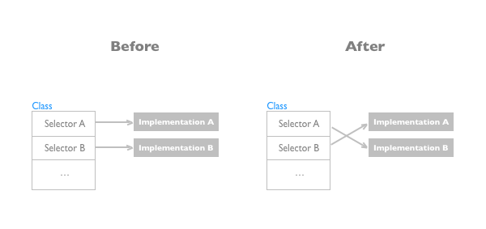
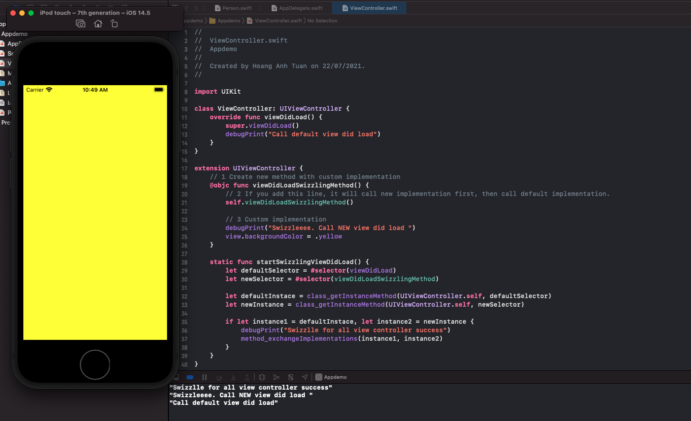
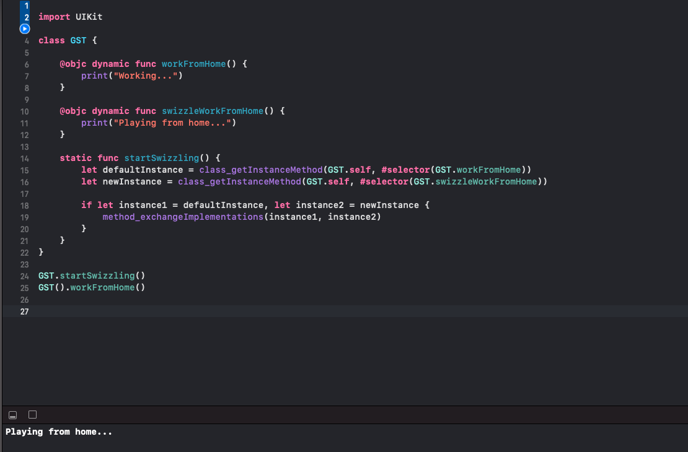

<!--more-->

## Problems?

If you meet one of these situations, how will you handle?
- A 3rd party SDK only provides you a function named "showLoginView()" to present a LoginViewController. The problem is all of view controllers in your app use a custom background color? So how can we set background color for LoginViewController?
- 3rd party SDK saves value to UserDataDefault, but you expect that all keys must have a prefix, for example is "FPT". How can you do this?
...

## Method swizzling comes to rescue
### Defination

So what is method swizzling?

> Method swizzling is the process of changing the implementation of an existing selector at runtime.

Speak in a easy-to-understand way, method swizzling acts like swap(a, b) function. It will takes implementation of function 1 and function 2 and swap.



### Use swizzling to solve the problem

- So with method swizzling, we can change the implementation of viewDidLoad in LoginViewController to our custom implementation that calls change backgroundColor.

## Swizzling CocoaTouch class

To swizzle, you just need to follow some simple steps:
1. Create a new method with your custom implementation
2. Get default method selector reference
3. Get new method selector reference
4. Use objective-C runtime to switch the selectors

## Let’s swizzle

First, create a demo view controller and create new method with your custom implementation.

```swift
class ViewController: UIViewController {
    override func viewDidLoad() {
        super.viewDidLoad()
        debugPrint("Call default view did load")
    }
}

extension UIViewController {
    // 1 
    @objc func viewDidLoadSwizzlingMethod() {
        // 2 
        self.viewDidLoadSwizzlingMethod()
        
        // 3 
        debugPrint("Swizzleeee. Call NEW view did load ")
        view.backgroundColor = .yellow
    }
}
```
1. Create new method with custom implementation
2. If you add this line, it will call new implementation first, then call default implementation. If. you don’t add this line, it will call new implentation only.
3. Your custom implementation

Next, create a function where the swizzle takes place.
```swift
extension UIViewController {
...
     static func startSwizzlingViewDidLoad() {
        // 1
        let defaultSelector = #selector(viewDidLoad)
        let newSelector = #selector(viewDidLoadSwizzlingMethod)

        // 2
        let defaultInstace = class_getInstanceMethod(UIViewController.self, defaultSelector)
        let newInstance = class_getInstanceMethod(UIViewController.self, newSelector)
        
        // 3
        if let instance1 = defaultInstace, let instance2 = newInstance {
            debugPrint("Swizzlle for all view controller success")
            method_exchangeImplementations(instance1, instance2)
        }
    }
}
```
1. Create 2 selectors of default method and new method.
2. Create 2 references of 2 selectors by using class_getInstanceMethod
3. Use Objective-C runtime to “swaps implementation” of 2 selectors

The final step is call the function startSwizzlingViewDidLoad. We must swizzle before the viewController call it’s default viewDidLoad.
Here, I will swizzle at AppDelegate to make all ViewControllers in apps change backgroundColor to yellow.

```swift
class AppDelegate {
    func application(_ application: UIApplication, didFinishLaunchingWithOptions launchOptions: [UIApplication.LaunchOptionsKey: Any]?) -> Bool {
        UIViewController.startSwizzlingViewDidLoad()
        return true
    }

    ...
}
```



As you can see, all of our view controllers will be set backgroundColor to yellow color

## Swizzling custom Swift class

To use method swizzling with your Swift classes, you just need to do:
- The methods you want to swizzle ***must have the dynamic attribute***
- Flow the steps like swizzle CocoaTouch class

```swift
class GST {
    
    @objc dynamic func workFromHome() {
        print("Working...")
    }
    
    @objc dynamic func swizzleWorkFromHome() {
        print("Playing from home...")
    }
    
    static func startSwizzling() {
        let defaultInstance = class_getInstanceMethod(GST.self, #selector(GST.workFromHome))
        let newInstance = class_getInstanceMethod(GST.self, #selector(GST.swizzleWorkFromHome))
        
        if let instance1 = defaultInstance, let instance2 = newInstance {
            method_exchangeImplementations(instance1, instance2)
        }
    }
}
```

And the results:



## Note

1. If you swizzle multiple times default method, that default method will have the implementation of the lastest swizzle method.
Example: 
- You swizzle viewDidLoad with your custom method in your AppDelegate.
- 3rd party SDK swizzle viewDidLoad with its custom method when 3rd party SDK init in your app => after AppDelegate.
- When a ViewController init => It will takes the implementation of 3rd party SDK's custom method instead of your, because that SDK swizzle after your swizzle

2. If you are shipping a framework which is used by hundreds of apps, better not to use swizzling in this case. If you must use swizzling, you should added it to the framework’s document.

References
- https://abhimuralidharan.medium.com/method-swizzling-in-ios-swift-1f38edaf984f
- https://www.uraimo.com/2015/10/23/effective-method-swizzling-with-swift/