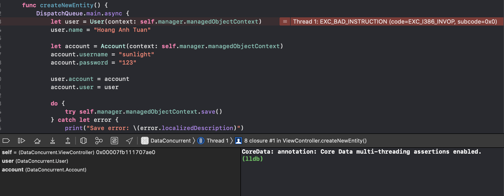

<!--more-->

## Tóm tắt về CoreData

Các thành phần chính của CoreData:
- Managed Object Model
- Managed Object Context
- Persistent store coordinator


## MultiThreading with CoreData

Khi khởi tạo managedObjectContext(MOC) thì sẽ có thể lựa chọn 1 trong 2 loại queue để khởi tạo MOC, đó là:
- NSMainQueueConcurrencyType (main Thread)
- NSPrivateQueueConcurrencyType (background Thread)

NSMainQueueConcurrencyType ***chỉ có thể được sử dụng trên main queue***.
NSPrivateQueueConcurrencyType tạo ra 1 queue riêng để sử dụng. Vì queue này là ***private***, nên chỉ có thể access queue thông qua hàm ***perform(_:)*** và ***performAndWait(_:)*** của MOC.


Nếu ứng dụng sử dụng nhiều thao tác data processing (parse JSON to data, …) thì việc sử dụng trên main queue sẽ gây ra block main. Khi đó, có thể khởi tạo 1 context dùng private queue và thực hiện xử lí data trên đó.

***Trước khi sử dụng CoreData với MultiThread, chú í đến điều Apple recommend***:
> Hãy chắc chắn rằng MOC được sử dụng trên thread(queue) mà chúng được liên kết khi khởi tạo.

Nếu MOC không được sử dụng trên thread(queue) mà chúng được liên kết, trong trường hợp MOC liên kết với mainQueue nhưng được sử dụng trên background thread, hoặc ngược lại, ***sẽ khiến app đôi lúc sẽ gặp những lỗi crash lạ***.

Vì vậy ***để chắc chắn MOC luôn được sử dụng trên thread mà MOC được liên kết, thì có thể sử dụng perform( _:) và performAndWait( _:) như sau***:


- ***perform( _:) và performAndWait( _:) sẽ tự động đưa đoạn code bên trong nó thực hiện trên queue mà context đó được khởi tạo*** -> Điều đó sẽ chắc chắn rằng context được sử dụng trên đúng queue.
- perform(_:) sẽ thực hiện async hàm bên trong nó.
- performAndWait(_:) sẽ thực hiện sync hàm bên trong nó -> Nó sẽ block thread hiện tại gọi đến hàm đó cho đến khi hàm bên trong thực hiện xong -> Không nên gọi trên main.

## Debug Concurrency
Để đảm bảo Context được chạy trên đúng luồng nó được liên kết khi khởi tạo, có thể bật debug CoreData Concurrency như sau:


- Chọn Edit Scheme -> Run -> Thêm "-com.apple.CoreData.ConcurrencyDebug 1".
- Khi bật debug này lên, nó sẽ dừng app của bạn lại tại nơi context bị dùng sai Thread.

Ví dụ:
- Khởi tạo 1 context bằng private queue:
```swift
private(set) lazy var managedObjectContext: NSManagedObjectContext = {
   let managedObjectContext = NSManagedObjectContext(concurrencyType: .privateQueueConcurrencyType)
   managedObjectContext.persistentStoreCoordinator = persistentStoreCoordinator
   return managedObjectContext
}()
```
- Sử dụng 1 context trên main:
```swift
func createNewEntity() {
   DispatchQueue.main.async {
       let user = User(context: self.manager.managedObjectContext)
       user.name = "Hoang Anh Tuan"
            
       let account = Account(context: self.manager.managedObjectContext)
       account.username = "sunlight"
       account.password = "123"
            
       user.account = account
       account.user = user
            
       do {
           try self.manager.managedObjectContext.save()
       } catch let error {
           print("Save error: \(error.localizedDescription)")
       }
    }
}
```
- Kết quả khi bật debug:



## Kết luận
- Nên dùng background thread cho context để tránh block main thread.
- Nên dùng các hàm perform( _:) và performAndWait( _:) để đảm bảo context được chạy trên đúng luồng
- Ngoài cách ở trên thì còn 1 vài cách như sử dụng child/parent context, nhưng sẽ không được đề cập ở bài viết này

## Refer
- https://developer.apple.com/documentation/coredata/using_core_data_in_the_background
- https://developer.apple.com/library/archive/documentation/Cocoa/Conceptual/CoreData/Concurrency.html#//apple_ref/doc/uid/TP40001075-CH24-SW1
- https://medium.com/@aliakhtar_16369/mastering-in-coredata-part-11-multithreading-concurrency-rules-70f1f221dbcd
- Child/Parent Context in CoreData MultiThreading: https://medium.com/@aliakhtar_16369/mastering-in-coredata-part-14-multithreading-concurrency-strategy-parent-child-context-305d986f1ac3