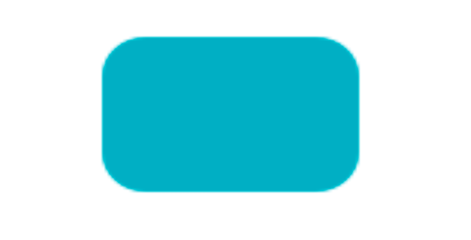
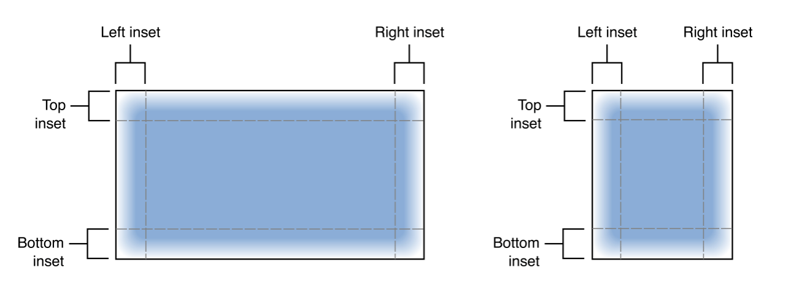
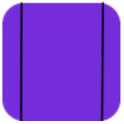
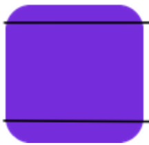
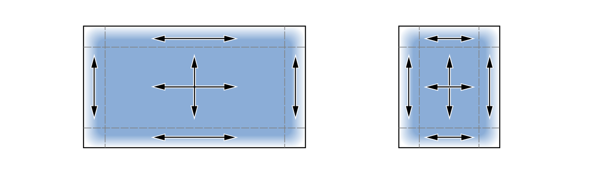
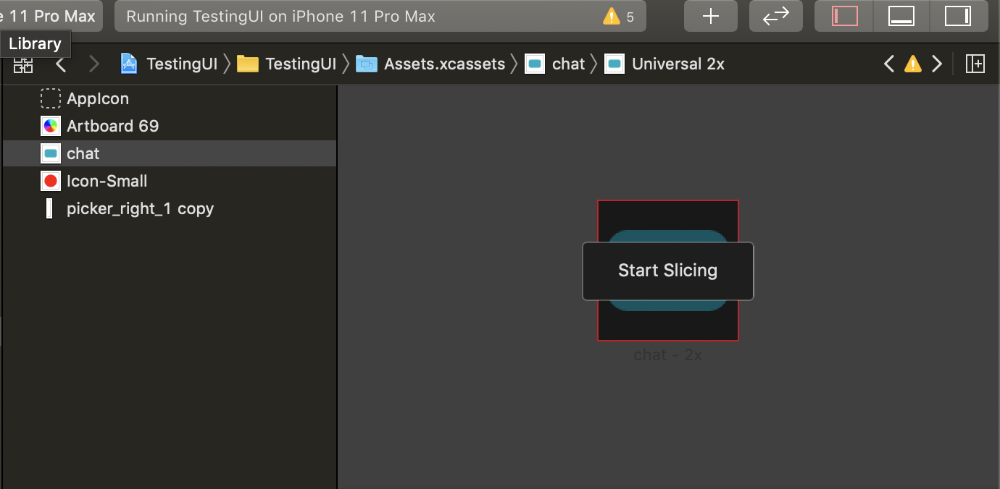
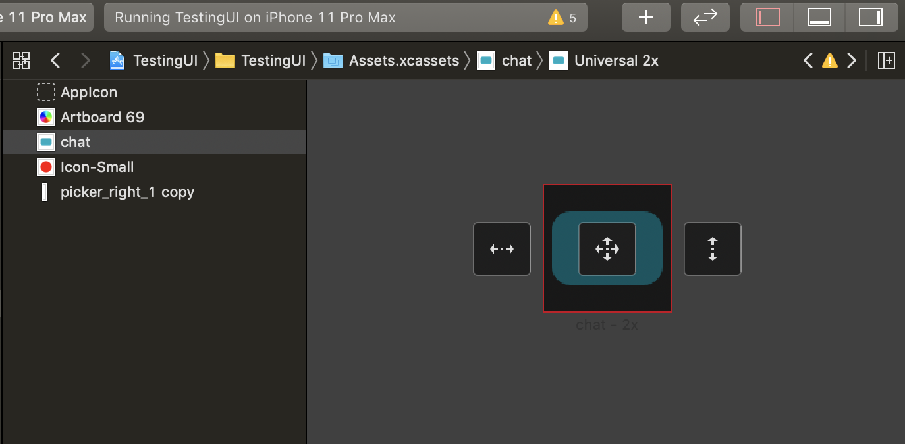
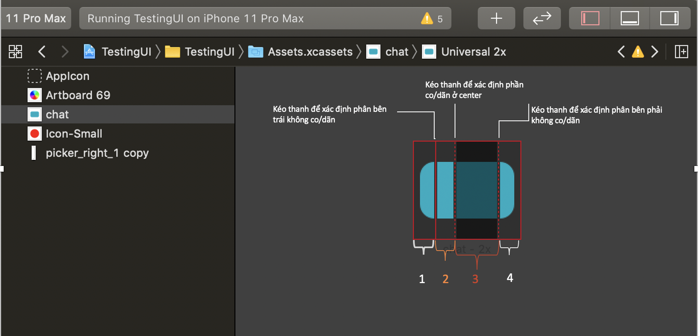

<!--more-->

## 1 Tổng quan

Trong 1 app iOS, sẽ có những buttons, views,… có kích thước khác nhau nhưng lại có cùng 1 background image.
Nếu chỉ đơn giản dùng 1 background image cho các buttons, views,… đó thì bạn sẽ gặp phải tình trạng sau:




Trong trường hợp này, việc sử dụng chung 1 image sẽ làm image bị co/dãn, làm xấu ảnh.
***Vậy nếu bạn chỉ muốn co/dãn phần giữa của ảnh, còn các phần ở 4 góc không bị co/dãn -> Hãy dùng slicing image.***

Slicing image cho phép bạn có thể cắt 1 bức ảnh theo chiều dọc, chiều ngang hoặc cả ngang và dọc.


- Nếu cắt theo chiều dọc, bạn sẽ chia bức ảnh làm 3 phần: Left, center và right. Trong trường hợp này, phần left và right là không co/dãn theo chiều ngang, ***phần center là phần co/dãn theo chiều ngang***

<div style="text-align: center;">
  
</div>

- Nếu cắt theo chiều ngang, bạn sẽ chia bức ảnh làm 3 phần là top, center và bottom. Trong trường hợp này, phần top và bottom là không co/dãn theo chiều dọc, ***phần center là phần co/dãn theo chiều dọc***

<div style="text-align: center;">

</div>

- Nếu cắt theo chiều cả ngang và dọc, bạn sẽ chia bức ảnh làm 9 phần như ảnh trên và từng phần sẽ co/dãn như ảnh dưới.



## 2 Cắt ảnh bằng Xcode Slicing Feature

1. Chọn vào phần Assets.xcassets trong Xcode.
2. Chọn ảnh cần cắt.
3. Chọn Editor -> Show Slicing hoặc chọn nút Show Slicing ở góc dưới bên phải.
4. Chon Start Slicing

5. Chọn cắt ảnh theo chiều ngang, chiều dọc hoặc cả ngang và dọc.

6. Kéo các thanh để xác định phần bên phải, phần bên trái.

- Phần 1: Phần không bị co/dãn bên trái theo chiều ngang.
- Phần 2: Phần sẽ bị co/dãn theo chiều ngang.
- Phần 3: Phần sẽ bị xóa khỏi ảnh mới.
- Phần 4. Phần không bị co/dãn bên phải theo chiều ngang.


## 3 Cắt ảnh bằng code

Bạn tạo ra 1 ảnh mới bằng cách cắt 1 ảnh có sẵn bằng hàm: *resizableImage(withCapInsets:) hoặc resizableImage(withCapInsets:resizingMode:)*

```
if let img = UIImage(named: "button") {
    let resizable = img.resizableImage(withCapInsets: UIEdgeInsets(top: 0, left: 24, bottom: 0, right: 24), resizingMode: .stretch)
}
```

- Khai báo top và bottom # 0 nếu bạn muốn cắt ảnh theo chiều ngang.
- Khai báo left và right # 0 nếu bạn muốn cắt ảnh theo chiều dọc.
- Khai báo top, left, right và bottom # 0 nếu bạn muốn cắt ảnh theo cả ngang và dọc.

Hi vọng qua bài viết này, bạn sẽ không gặp khó khăn khi apply 1 ảnh cho các buttons, views có size khác nhau.
Link tham khảo: https://developer.apple.com/documentation/uikit/uiimage