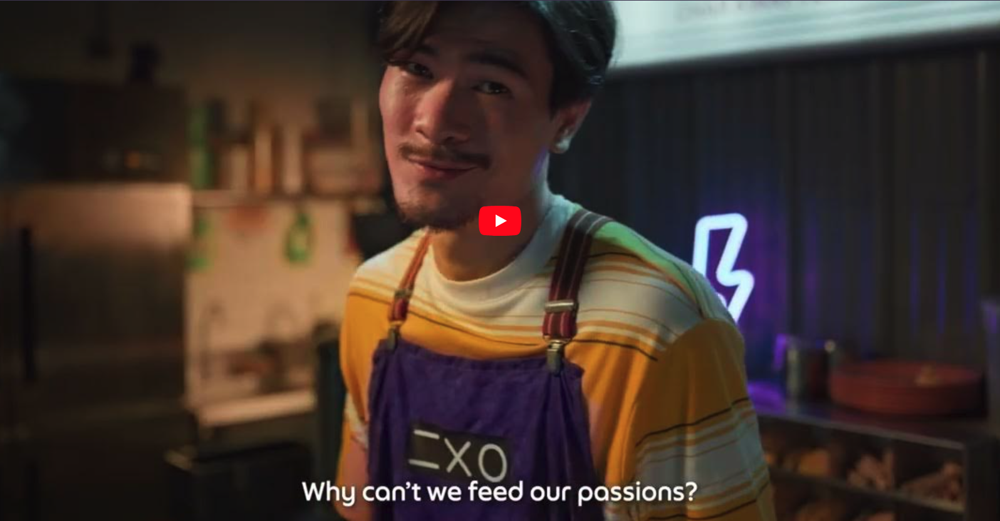

<!--more-->

Wow, thời gian trôi qua nhanh thiệt. Chớp mắt 1 cái mà đã đến lúc hành trình 1 năm với GxS của mình đã kết thúc. Tuy thời gian không quá dài, nhưng mình cảm thấy tự hào khi được đóng góp công sức để xây dựng lên 1 trong những digital bank đầu tiên ở Singapore.

Trong thời gian ở đây, mình đã học được rất nhiều võ công mới, có nhiều thứ mà mình mới chỉ nghe thấy lần đầu tiên. Điều làm mình thấy khác biệt so với những gì mình đã từng trải qua ở các công ty ở Việt Nam đó là mindset làm việc. 

Tin rằng những mindset làm việc này là quan trọng để giúp anh em đi xa hơn trong công việc, cũng như mình thấy tiếc vì mình đã không được học những mindset này sớm hơn, cho nên mình viết post này để chia sẻ lại cho anh em những góc nhìn mới.

Đầu tiên thì xin 1 phút giới thiệu về GxS :3 

## What is GxS?

Được thành lập bởi Grab và Singtel, GxS Bank là 1 trong 2 digital bank đầu tiên ở Singapore. Vậy điều gì làm GxS Bank khác biệt so với các ngân hàng khác?

Vision của GxS là redefine trải nghiệm của user khi dùng banking app. Không chỉ là đưa ra 1 đống features cho người dùng tự sử dụng, GxS hướng tới việc xây dựng hành vi quản lý tiền thông minh cho user, giúp người dùng sử dụng các dịch vụ banking 1 cách dễ dàng, ...

Bên cạnh đó, vì được thành lập bởi Grab, nên GxS thừa kế được lượng user lớn, những bài học & công nghệ từ Grab, qua đó giúp GxS đi nhanh và xa hơn.

Check out thêm về GxS ở đây nha: https://www.gxs.com.sg/

Okay, chuyển qua tiết mục chính thôi.

## Automation test is essential


Nếu bạn muốn project của bạn đi xa trong dài hạn, hãy viết automation test. Đừng phụ thuộc hoàn toàn vào QA


Mình đã trải qua vài project trước khi join GxS, và không có project nào yêu cầu viết automation test cả. Tất nhiên là mình cũng đã đọc vài articles về lợi ích của automation tests, tại sao chúng lại quan trọng, nhưng vì chưa bao giờ áp dụng vào 1 project nên mình cũng không để tâm quá nhiều và có mindset là cứ nhờ QA test là được rồi. Có dự án mà PO cũng phải nhảy vào test vì công ty không có quá nhiều QA 😂   

Công việc chính của anh em trong team là fix bug, fix bug và bug fix. Mỗi lần update 1 đoạn logic để fix bug này thì nó lại tạo ra bug mới ở chỗ khác, hay bug fix rồi thì sau 1 thời gian lại bị reopen bởi 1 engineer nào đó thay đổi logic, … Mọi chuyện còn tệ hơn khi dự án quá lớn theo thời gian và nó ***gần như không khả thi khi muốn refactor 1 phần business logic***.


Có lần mình đã phải refactor 1 feature của app, và mình đã phải sửa gần 3000 lines of code. Lúc đó mình còn đang là sinh viên vẫn đang còn đi học & chưa có quá nhiều knghiem, và project thì không hề có unit tests 🥲 Sau vụ refactor đó thì team phải nhờ team QAs test lại toàn bộ app và tin tưởng rằng mọi thứ vẫn sẽ ổn (vì ngoài niềm tin ra thì mình không còn gì cả 🙂)


Ở GxS nói riêng và các tech company nói chung, automation tests là 1 trong những phần quan trọng. Sau 2 năm bắt đầu dự án, project đã có hơn 3000 unit tests & UI tests với coverage ~90%. Ngoài ra team cũng thảo luận rất nhiều để đảm bảo mỗi unit test đều mang lại thêm protection cho codebase.    
(Có 1 bank khác ở Singapore cũng có coverage ~90%, tuy nhiên rất nhiều test chỉ để cho vui chứ không mang lại 1 chút lợi ích gì 🙂)    
Nhờ việc chú trọng vào automation tests, ***nó giảm bớt rất nhiều công việc cho QA và ngăn chặn các hidden bugs, tiết kiệm rất nhiều thời gian và tiền bạc cho công ty + đem lại trải nghiệm tốt hơn cho người dùng***.

1 trường hợp đặc biệt là đối với công ty out source, khách hàng là người đưa ra quyết định. Nhiều khi họ không biết nhiều về tech, nghĩ việc develop 1 cái app là đơn giản nên yêu cầu release liên tục và quyết định không cần test. Cho đến 1 thời điểm khi app quá lớn và việc thêm 1 tính năng hay refactor app gần như trở nên bất khả thi và quá tốn chi phí, khách hàng sẽ blame bạn vì đã để điều đó xảy ra.

## Be responsible, proactive, and be open


Nếu bạn muốn tiến xa hơn trong công việc, hãy có trách nhiệm, chủ động và luôn open với góp ý từ người khác


Khi mình join GxS, mình rất ấn tượng bởi thái độ làm việc của engineers ở đây. Mỗi cá nhân đều có thể làm việc hoàn toàn độc lập, chủ động và có trách nhiệm. Họ thể hiện điều đó như thế nào?

- Responsible: Với task mà họ đã pick và commit, họ sẽ luôn đưa ra 1 solution scalable và thực chứ không phải chỉ 1 solution tạm thời, luôn cố gắng đảm bảo hoàn thành task trước deadline, nếu không kịp thì sẽ thông báo với team sớm để kịp thời để tìm hướng giải quyết, hay là luôn ready support ngay cả 11h đêm... Đúng kiểu gọi là có mặt, đến là đón.. 🫡

- Proactive: 
    - Bên cạnh feature task, team có 1 dashboard chứa các ticket cần làm để cải thiện chất lượng project / cải thiện engineer experience / cải thiện performance (Mình thấy riêng vụ dashboard này cũng khá là hay 👍🏻). Các engineers trong team luôn chủ động pick các task trong board này khi họ có thời gian rảnh rỗi. 
    - Trong project thì luôn proactive tìm hiểu về business của app, đóng góp ý kiến với backend, PM, designer để thay đổi requirement cho phù hợp

- Be open: Well, nói thật thì khi ở Việt Nam, có lúc mình đã gặp trường hợp những engineer không muốn nhận feedback từ engineer ít tuổi hơn, bạn bè mình cũng đã từng chia sẻ nhiều trường hợp như vậy. Ở GxS, mình thấy ai cũng rất open với mọi lời góp ý. A leader của mình ở GxS hay bảo là “Không ai là biết hết mọi thứ” :3

> “In every man there is something wherein I may learn of him, and in that I am his pupil.” - Ralph Waldo Emerson”

## Working as a "real" team


If you want your team to become more effective, start working as a team, not coding "heroes"


Trong những dự án mình từng trải qua, mỗi dự án phụ thuộc rất nhiều vào 2 hoặc 3 core engineers của team, trong khi các engineers khác trong nhóm chỉ làm những tasks không quá quan trọng.
Những core engineers này **làm tất cả những features khó nhất, review mọi MR + giữ quyền merge, chịu trách nhiệm chính về mọi features của dự án**. Tệ hơn nữa, khi các junior/middle engineer làm không tốt, **thì những core engineers này sẽ im lặng mà đập đi hết và xây lại từ đầu mà không cần discuss với junior/middle engineer để chỉ rằng họ đang làm sai ở đâu**.   

Vậy điều này thì có gì không tốt?    
- Điều này **cướp đi cơ hội học hỏi của junior/middle engineer**
- Core engineers nắm quá nhiều việc thì dần dần họ trở thành 1 phần không thể thay thế trong dự án, và cuối cùng thì họ **trở thành bottlneck của dự án**.
- Anh em core engineers thì blame anh em junior code chán nên họ phải làm thêm 1 đống việc, anh em junior bị đập hết code đi cũng tự ti hơn,…   

-> Team thiếu sự gắn kết + tin tưởng nhau.

Ở GxS, các engineers luôn tin tưởng và tôn trọng lẫn nhau.   
Ví dụ như 1 junior engineer chưa đến 1 năm exp vẫn được giao cho take care cả 1 feature chính, reviews MR của middle/senior engineer, nhận trách nhiệm on-call, ... Hay khi 1 MR được raise lên, mọi người sẽ cùng nhau vào review + góp ý để engineer tự improve code của mình, …

> 1 vài articles hay về chủ đề này:    
> - Ex-leader của mình đã share bài viết này: [How to prevent coding "heroes" from destroying the team](https://hackernoon.com/thoughts-on-software-development-heroes-5ec656c2e31a)   
> - [True story: Công ty sa thải nhân viên giỏi nhất của họ](https://www.freecodecamp.org/news/we-fired-our-top-talent-best-decision-we-ever-made-4c0a99728fde/)

Một điều nữa là ở những dự án trước đây của mình, engineer chỉ quan tâm đến features/tasks của họ đang làm và không biết những tính năng mà người khác đang thực hiện, vì vậy nên mỗi engineer chưa bao giờ hiểu toàn bộ về ứng dụng.

Ở GxS, mặc dù chia ra làm nhiều squad team, nhưng iOS team sẽ họp 2 tuần một lần. Trong cuộc họp, mỗi engineer sẽ nói overview về feature mình đang làm, những issue hay bài học họ đã học dc. Vì vậy, mỗi engineer đều hiểu về dự án và có thể bắt tay ngay vào việc hỗ trợ các tính năng khác bất cứ khi nào team cần.

> Teamwork makes dream work

## Sharing culture


If you want to be good, ask a lot, share a lot


Mỗi khi thấy 1 issue gì đó cần được rút kinh nghiệm, các bạn engineers sẽ mang nó post lên trên nhóm. Không phải để blame cho người gây ra vấn đề mà cùng nhau thảo luận, tìm ra giải pháp và cùng nhau rút ra bài học.
Hay đôi khi  1 engineer nào đó học được điều gì đó mới có thể áp dụng cho dự án, họ cũng đưa lên để cả team cùng nhau thảo luận.

Mình nghĩ điều quan trọng là bạn không nên sợ rằng ý tưởng của mình sai hoặc bạn hỏi một câu hỏi ngớ ngẩn. Chỉ cần bạn học được điều gì từ nó thì cứ hỏi (nhưng hãy đảm bảo rằng bạn đã nghiên cứu kỹ về nó trước đó 😉)

> Sharing is learning

Trên đây là 1 vài mindset mà mình thấy khá là quan trọng và ước là mình đã có thể học được sớm hơn. Hi vọng bạn thấy hay và có thể áp dụng nó cho dự án & team của bạn.
